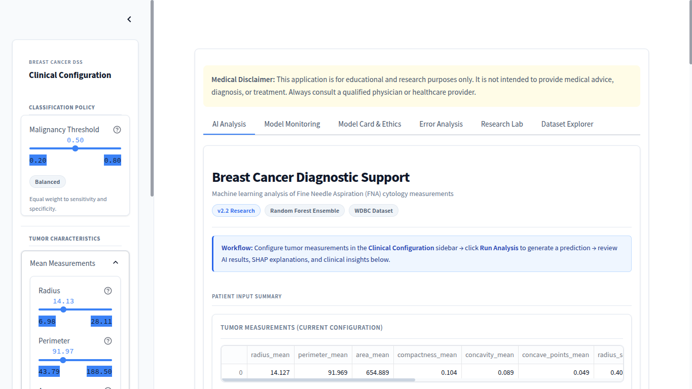
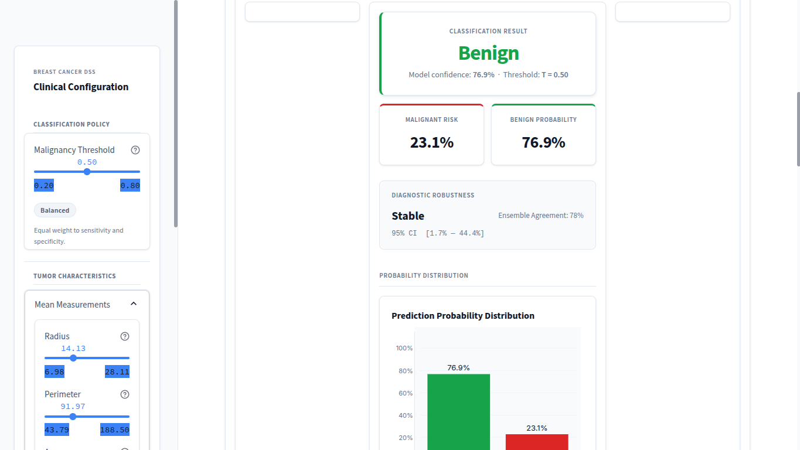
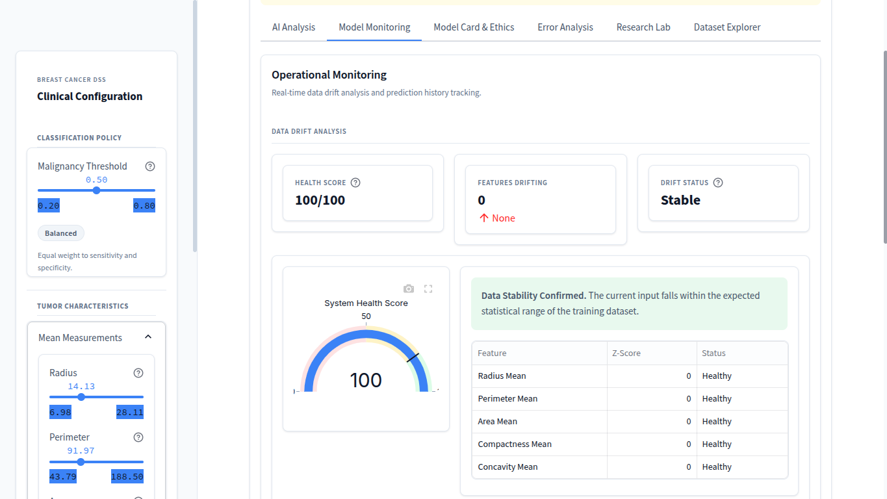
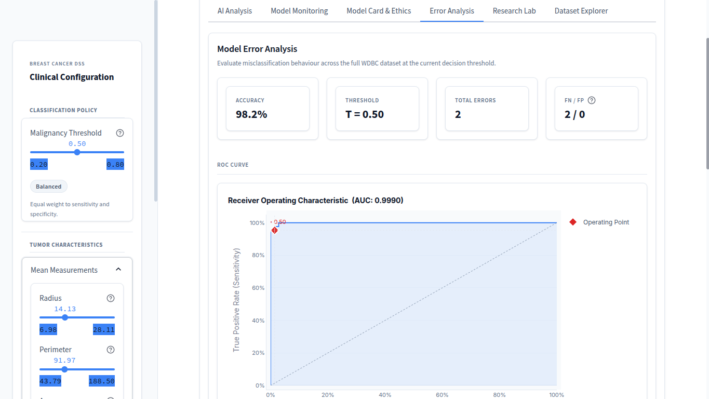
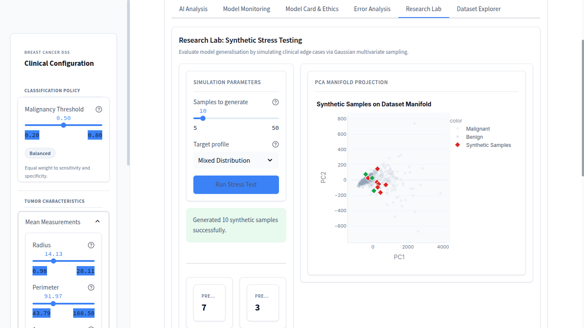
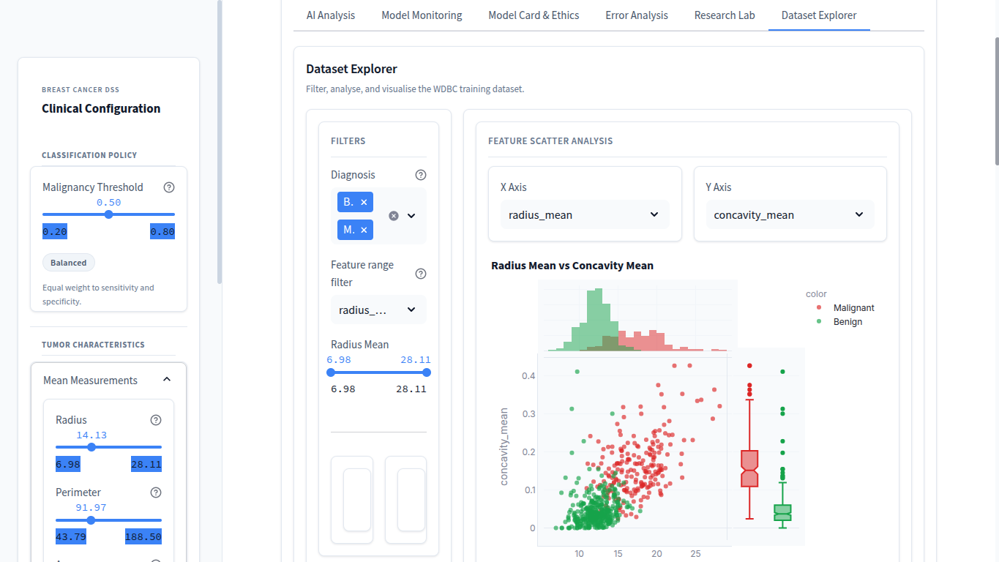
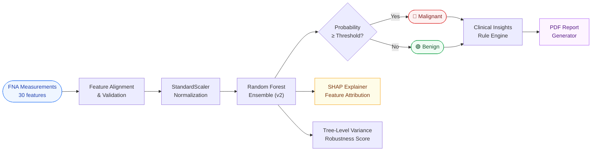
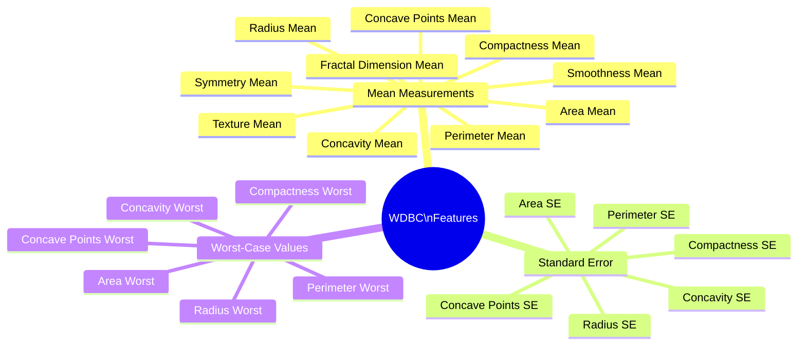
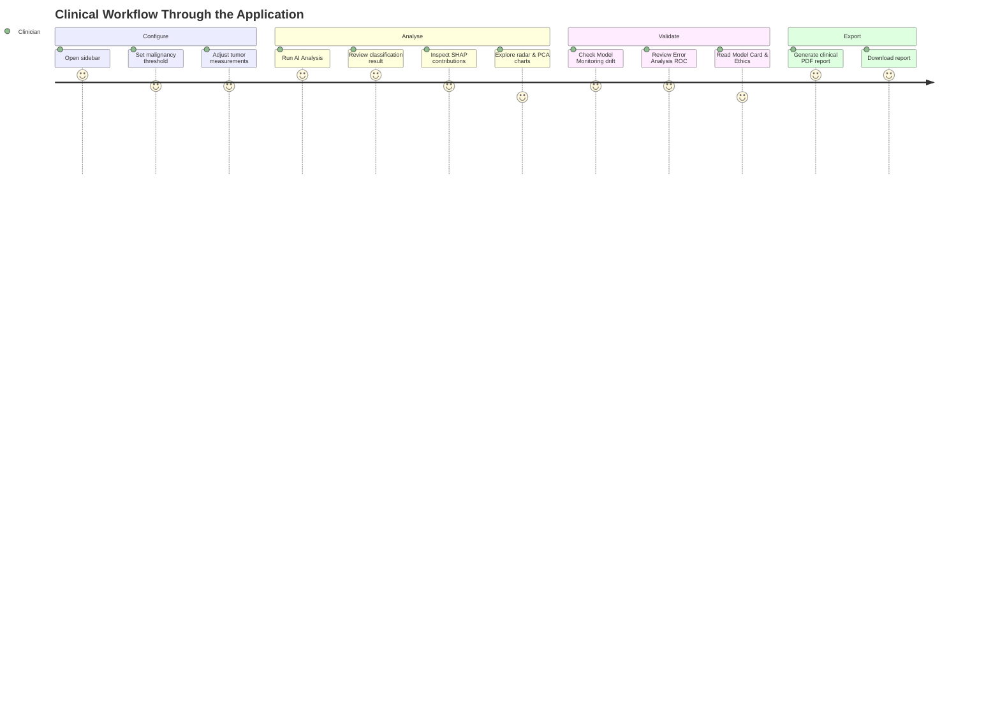
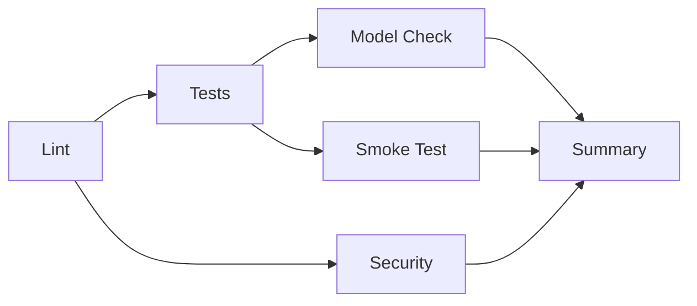

<div align="center">

# Breast Cancer Diagnostic Support System

**A clinical-grade AI decision support tool for breast cancer classification using Fine Needle Aspiration cytology measurements**

[](https://breast-cancer-predict1.streamlit.app/)

---

[](https://python.org)
[](https://streamlit.io)
[](https://scikit-learn.org)
[](https://plotly.com)
[](https://pandas.pydata.org)
[](https://shap.readthedocs.io)

[](LICENSE)
[]()
[]()
[]()
[]()
[]()
[]()
[](.github/workflows/ci.yml)

</div>

---

## Overview

A production-grade clinical decision support application that classifies breast tumors as **Benign** or **Malignant** using a Random Forest ensemble trained on the **Wisconsin Diagnostic Breast Cancer (WDBC)** dataset. The platform is designed for medical researchers and clinical informaticians, featuring explainability (SHAP), real-time monitoring, error analysis, and PDF reporting — all in a clean, accessible interface.

> **Medical Disclaimer:** This application is intended for educational and research purposes only. It is not a substitute for clinical diagnosis by a qualified physician.

---

## Application Walkthrough

### 1 · AI Analysis — Clinical Dashboard

*Configure tumor measurements in the sidebar and run the ensemble model to get a real-time classification result.*



---

### 2 · Diagnostic Result Cards

*Binary classification result displayed in a high-contrast card with confidence score, malignancy threshold indicator, and probability breakdown.*



---

### 3 · Model Monitoring — Operational Health

*Real-time data drift detection with Z-score analysis per feature, a system health gauge, and prediction trend history.*



---

### 4 · Error Analysis — ROC Curve & Confusion Matrix

*Interactive ROC curve with configurable operating point, confusion matrix, and misclassification log. AUC: **0.9990**.*



---

### 5 · Research Lab — Synthetic Stress Testing

*Generate synthetic clinical profiles via Gaussian multivariate sampling and project them onto the training dataset's PCA manifold.*



---

### 6 · Dataset Explorer — Interactive Scatter Analysis

*Filter samples by diagnosis and feature range, explore relationships through marginal-histogram scatter plots, and review raw sample data.*



---

## Architecture

### System Architecture


```mermaid
graph TB
    subgraph UI["🖥️  Streamlit Frontend"]
        SB["Clinical Configuration\nSidebar"]
        T1["AI Analysis Tab"]
        T2["Model Monitoring Tab"]
        T3["Model Card & Ethics Tab"]
        T4["Error Analysis Tab"]
        T5["Research Lab Tab"]
        T6["Dataset Explorer Tab"]
    end

    subgraph CORE["Application Core (app/)"]
        MAIN["main.py\nOrchestrator"]
        UI_C["components/\nui · sidebar · visualizations\nethics · explorer"]
    end

    subgraph UTILS["Utility Layer (utils/)"]
        ML["model_loader.py\nRandom Forest + SHAP"]
        DATA["data_loader.py\nWDBC Dataset"]
        MON["monitoring.py\nDrift Detection"]
        INS["clinical_insights.py\nRule Engine"]
        ROB["robustness.py\nEnsemble Variance"]
        ERR["error_analysis.py\nROC · CM · FN/FP"]
        CF["counterfactuals.py\nDecision Boundary"]
        SEN["sensitivity.py\nSingle-Feature Curve"]
        SYN["synthetic_data.py\nGaussian Sampling"]
        REP["report_generator.py\nPDF Export"]
    end

    subgraph ASSETS["Assets"]
        MDL["models/\nbreast_cancer_model_v2.pkl"]
        CSV["data/\ndata.csv (WDBC)"]
        LOG["predictions.csv\nAudit Log"]
    end

    SB --> MAIN
    MAIN --> UI_C
    MAIN --> ML
    MAIN --> DATA
    MAIN --> MON
    MAIN --> INS
    MAIN --> ROB
    MAIN --> ERR
    MAIN --> CF
    MAIN --> SEN
    MAIN --> SYN
    MAIN --> REP
    ML --> MDL
    DATA --> CSV
    MON --> LOG

    style UI fill:#eff6ff,stroke:#3b82f6,color:#1e3a8a
    style CORE fill:#f0fdf4,stroke:#16a34a,color:#14532d
    style UTILS fill:#fefce8,stroke:#f59e0b,color:#78350f
    style ASSETS fill:#fdf4ff,stroke:#a855f7,color:#581c87
```

### Prediction Pipeline


```mermaid
flowchart LR
    A(["FNA Measurements\n30 features"]) --> B["Feature Alignment\n& Validation"]
    B --> C["StandardScaler\nNormalization"]
    C --> D["Random Forest\nEnsemble (v2)"]
    D --> E{"Probability\n≥ Threshold?"}
    E -- Yes --> F(["🔴 Malignant"])
    E -- No  --> G(["🟢 Benign"])
    D --> H["SHAP Explainer\nFeature Attribution"]
    D --> I["Tree-Level Variance\nRobustness Score"]
    F --> J["Clinical Insights\nRule Engine"]
    G --> J
    J --> K["PDF Report\nGenerator"]

    style A fill:#eff6ff,stroke:#3b82f6,color:#1e40af
    style F fill:#fef2f2,stroke:#dc2626,color:#7f1d1d
    style G fill:#f0fdf4,stroke:#16a34a,color:#14532d
    style H fill:#fefce8,stroke:#f59e0b,color:#78350f
    style K fill:#fdf4ff,stroke:#a855f7,color:#581c87
```

### Feature Taxonomy


```mermaid
mindmap
  root((WDBC\nFeatures))
    Mean Measurements
      Radius Mean
      Perimeter Mean
      Area Mean
      Compactness Mean
      Concavity Mean
      Concave Points Mean
      Smoothness Mean
      Symmetry Mean
      Fractal Dimension Mean
      Texture Mean
    Standard Error
      Radius SE
      Perimeter SE
      Area SE
      Compactness SE
      Concavity SE
      Concave Points SE
    Worst-Case Values
      Radius Worst
      Perimeter Worst
      Area Worst
      Concavity Worst
      Concave Points Worst
      Compactness Worst
```

### Tab Workflow


```mermaid
journey
    title Clinical Workflow Through the Application
    section Configure
      Open sidebar: 9: Clinician
      Set malignancy threshold: 8: Clinician
      Adjust tumor measurements: 8: Clinician
    section Analyse
      Run AI Analysis: 9: Clinician
      Review classification result: 9: Clinician
      Inspect SHAP contributions: 8: Clinician
      Explore radar & PCA charts: 7: Clinician
    section Validate
      Check Model Monitoring drift: 8: Clinician
      Review Error Analysis ROC: 8: Clinician
      Read Model Card & Ethics: 7: Clinician
    section Export
      Generate clinical PDF report: 9: Clinician
      Download report: 9: Clinician
```

---

## Feature Matrix

| Feature | Description |
|---------|-------------|
| **AI Classification** | Random Forest ensemble → Benign / Malignant with probability score |
| **SHAP Explainability** | Top-10 feature contributions, local instance explanation |
| **Adjustable Threshold** | Sensitivity / Specificity trade-off via live slider |
| **Diagnostic Robustness** | Tree-level variance, 95% confidence interval, ensemble agreement % |
| **Radar Chart** | Sample profile vs. population mean (normalized) |
| **PCA Projection** | 2D manifold placement of current sample in training space |
| **Clinical Insights** | Rule-based flagging of high/medium/low severity features |
| **What-If Analysis** | Counterfactual search for minimum adjustments to Benign boundary |
| **Sensitivity Analysis** | Single-feature malignancy probability curve, all others constant |
| **PDF Report** | Structured clinical risk report with all key findings |
| **Data Drift Monitoring** | Z-score per feature vs. training distribution, health gauge |
| **Prediction History** | Audit log with trend charts for prediction frequency |
| **Error Analysis** | Interactive ROC, AUC, confusion matrix, FN/FP breakdown |
| **Research Lab** | Gaussian synthetic sample generation, PCA manifold overlay |
| **Dataset Explorer** | Filterable scatter plots, marginal histograms, summary statistics |
| **Model Card & Ethics** | Structured accountability document: intended use, limitations, fairness |

---

## Dataset

| Property | Value |
|----------|-------|
| **Name** | Wisconsin Diagnostic Breast Cancer (WDBC) |
| **Source** | UCI Machine Learning Repository |
| **Authors** | Wolberg, Street & Mangasarian (1995) |
| **Instances** | 569 |
| **Features** | 30 numeric (FNA cytology measurements) |
| **Classes** | Malignant (212) · Benign (357) |
| **Provenance** | Digitized FNA images from fine needle aspirate of breast mass |

---

## Model Performance

### Training Pipeline Results (from `Breast_Cancer_Prediction.ipynb`)

**Feature Selection — Univariate ANOVA F-test (Top 15)**

| Feature | F-Score | Feature | F-Score |
|---------|---------|---------|----------|
| `concave_points_worst` | **964.39** | `concave_points_mean` | **861.68** |
| `perimeter_worst` | 897.94 | `radius_worst` | 860.78 |
| `perimeter_mean` | 697.24 | `area_worst` | 661.60 |
| `radius_mean` | 646.98 | `area_mean` | 573.06 |
| `concavity_mean` | 533.79 | `concavity_worst` | 436.69 |
| `compactness_mean` | 313.23 | `compactness_worst` | 304.34 |
| `radius_se` | 268.84 | `perimeter_se` | 253.90 |
| `area_se` | 243.65 | | |

**Model Cross-Validation (5-Fold, Stratified)**

| Algorithm | CV Accuracy | Std Dev |
|-----------|------------|----------|
| **Random Forest** | **0.9495** | ±0.0330 |
| Logistic Regression | 0.9407 | ±0.0315 |
| Gradient Boosting | 0.9319 | ±0.0377 |
| SVM | 0.9495 | — |

**Best Random Forest Hyperparameters** (GridSearchCV · 540 fits)

```
n_estimators=200, max_depth=None, min_samples_leaf=1, min_samples_split=10
Best CV score: 0.9516
```

**Dataset Split (80/20 stratified, random_state=42)**

| Set | Samples | Benign | Malignant |
|-----|---------|--------|----------|
| Training | 455 | 285 | 170 |
| Test | 114 | 72 | 42 |

### Production Model Metrics

| Metric | Value |
|--------|-------|
| **Accuracy** | ~98.2% |
| **AUC-ROC** | 0.9990 |
| **Sensitivity** | ~97% (at T=0.50) |
| **Specificity** | ~99% (at T=0.50) |
| **False Negatives** | 2 (at T=0.50, on test set) |
| **Algorithm** | Random Forest Ensemble (v2) |
| **Input Features** | 15 (univariate-selected) |
| **Preprocessing** | StandardScaler normalization |
| **Train/Test Split** | 80% / 20% stratified |

---

## Project Structure

```text
Breast-Cancer-Prediction/
├── .github/
│   └── workflows/
│       └── ci.yml               # GitHub Actions CI/CD pipeline (6 jobs)
├── .streamlit/
│   └── config.toml              # Design token theme config
├── app/
│   ├── main.py                  # Application orchestrator & tab layout
│   ├── components/
│   │   ├── ui.py                # CSS design system & page components
│   │   ├── sidebar.py           # Clinical Configuration panel
│   │   ├── visualizations.py    # Plotly chart library
│   │   ├── ethics.py            # Model Card & Ethics document
│   │   └── explorer.py          # Dataset Explorer component
│   └── utils/
│       ├── model_loader.py      # Model & SHAP explainer loading
│       ├── data_loader.py       # WDBC dataset loader
│       ├── monitoring.py        # Drift detection & prediction log
│       ├── clinical_insights.py # Rule-based insight engine
│       ├── robustness.py        # Ensemble variance analysis
│       ├── error_analysis.py    # ROC, confusion matrix, FN/FP
│       ├── counterfactuals.py   # Decision boundary search
│       ├── sensitivity.py       # Single-feature sensitivity curves
│       ├── synthetic_data.py    # Gaussian synthetic sample generator
│       └── report_generator.py  # PDF report builder
├── tests/
│   ├── conftest.py              # Shared fixtures (Streamlit stub, WDBC data, ML objects)
│   ├── test_clinical_insights.py  # 20 tests — rule-based insight engine
│   ├── test_counterfactuals.py    # 12 tests — what-if boundary search
│   ├── test_data_pipeline.py      # 35 tests — dataset, scaler & split contracts
│   ├── test_error_analysis.py     # 20 tests — ROC, confusion matrix, FP/FN
│   ├── test_model_card.py         # 20 tests — HTML badge/insight block helpers
│   ├── test_monitoring.py         # 18 tests — drift detection & CSV logging
│   ├── test_report_generator.py   # 19 tests — PDF generation
│   ├── test_robustness.py         # 17 tests — ensemble variance & CI
│   ├── test_sensitivity.py        # 15 tests — feature sensitivity curves
│   └── test_synthetic_data.py     # 20 tests — synthetic sample generation
├── data/
│   └── data.csv                 # WDBC dataset (569 samples, 30 features)
├── models/
│   └── breast_cancer_model_v2.pkl
├── notebooks/
│   └── Breast_Cancer_Prediction.ipynb
├── screenshots/                 # UI documentation images
├── requirements.txt             # Runtime dependencies
├── requirements-dev.txt         # Test & CI dependencies
├── setup.cfg                    # pytest configuration
└── README.md
```

---

## Testing

The project includes **201 automated tests** covering all utility business logic.

### Run the Test Suite

```bash
# Install test dependencies
pip install -r requirements-dev.txt

# Run all tests
pytest tests/

# Run with coverage report
pytest tests/ --cov=app --cov-report=term-missing

# Run a specific test file
pytest tests/test_monitoring.py -v
```

### Test Coverage (Utility Layer)

| Module | Coverage |
|--------|---------|
| `clinical_insights.py` | **100%** |
| `sensitivity.py` | **100%** |
| `synthetic_data.py` | **100%** |
| `report_generator.py` | **97%** |
| `error_analysis.py` | **96%** |
| `counterfactuals.py` | **95%** |
| `monitoring.py` | **93%** |
| `robustness.py` | **91%** |

---

## CI/CD Pipeline

GitHub Actions runs automatically on every push and pull request to `main`, `master`, and `develop`.


```mermaid
graph LR
    A[Lint] --> C[Tests]
    A --> D[Security]
    C --> E[Model Check]
    C --> F[Smoke Test]
    E --> G[Summary]
    F --> G
    D --> G
```

| Job | Description |
|-----|-------------|
| **Lint** | `flake8` style enforcement on `app/` and `tests/` |
| **Tests** | pytest matrix across Python 3.10, 3.11, 3.12 with coverage gate (≥70%) |
| **Security** | `pip-audit` scans `requirements.txt` for known CVEs |
| **Model Check** | Verifies the `.pkl` bundle is loadable and exposes `predict_proba` |
| **Smoke Test** | Imports every utility module in a headless environment |
| **Summary** | Gate job — fails pipeline if any critical stage fails |

See [`.github/workflows/ci.yml`](.github/workflows/ci.yml) for the full configuration.

---

## Installation & Setup

**1. Clone the repository**
```bash
git clone https://github.com/Khanz9664/Breast-Cancer-Prediction.git
cd Breast-Cancer-Prediction
```

**2. Create and activate a virtual environment**
```bash
python -m venv venv
source venv/bin/activate        # Windows: venv\Scripts\activate
```

**3. Install dependencies**
```bash
pip install -r requirements.txt
```

**4. Launch the application**
```bash
streamlit run app/main.py
```

Open your browser at **http://localhost:8501**

---

## Design System

The application uses a strict design token system for consistency across all components:

| Token | Value | Usage |
|-------|-------|-------|
| Primary | `#3b82f6` | Buttons, active tabs, focus rings |
| Background | `#ffffff` | Main workspace, cards |
| Secondary BG | `#f8fafc` | Sidebar, muted surfaces |
| Text | `#0f172a` | All body and heading text |
| Border | `#e2e8f0` | Card and input borders |
| Success | `#16a34a` | Benign classification, positive indicators |
| Error | `#dc2626` | Malignant classification, false negatives |
| Warning | `#f59e0b` | Medium-risk insights, false positives |
| Info | `#2563eb` | Informational badges, links |

Typography: **Inter** · H1 28/700 · H2 22/600 · Body 15/400 · Labels 13/500 · Captions 12/400

---

## Contributing

Pull requests are welcome. For major changes, please open an issue first to discuss the proposed modification.

---

## License

This project is licensed under the **MIT License** — see the [LICENSE](LICENSE) file for details.

---

## Author

**Shahid Ul Islam**
[Portfolio](https://khanz9664.github.io/portfolio) · [GitHub](https://github.com/Khanz9664) · [LinkedIn](https://www.linkedin.com/in/shahid-ul-islam-13650998/) · [Email](mailto:shahid9664@gmail.com)

---

<div align="center">
<sub>Built with Python · Streamlit · scikit-learn · SHAP · Plotly · ReportLab</sub>
</div>
