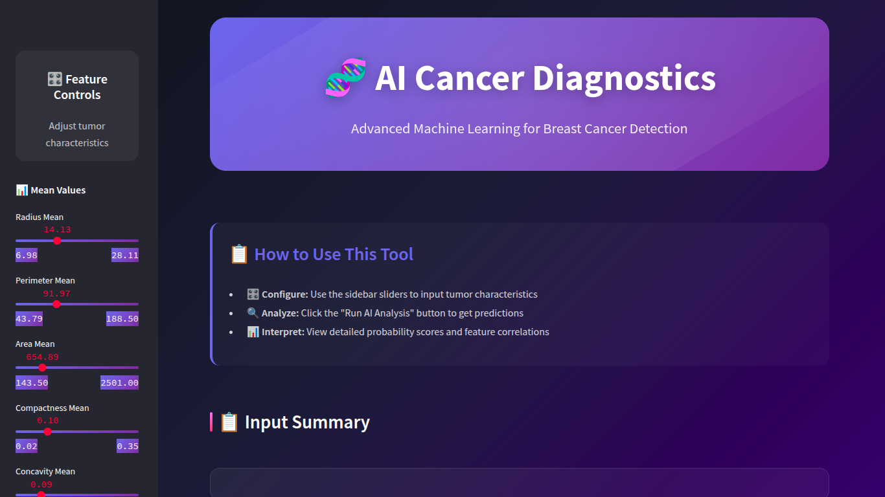
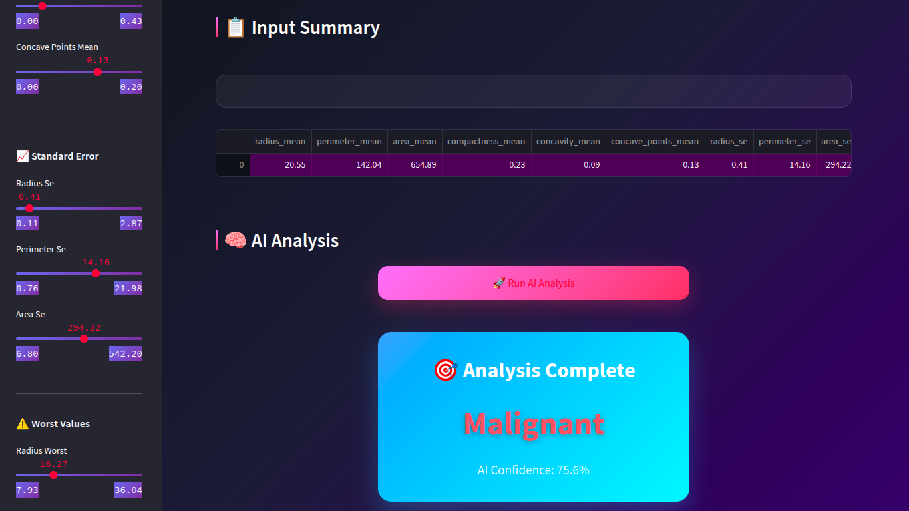
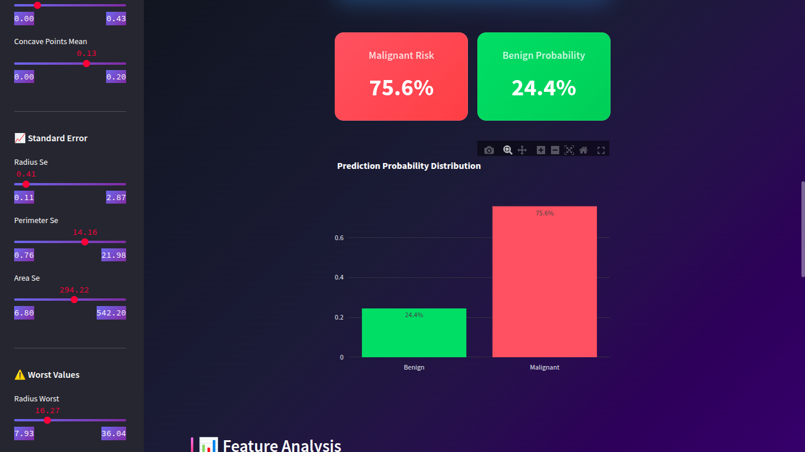
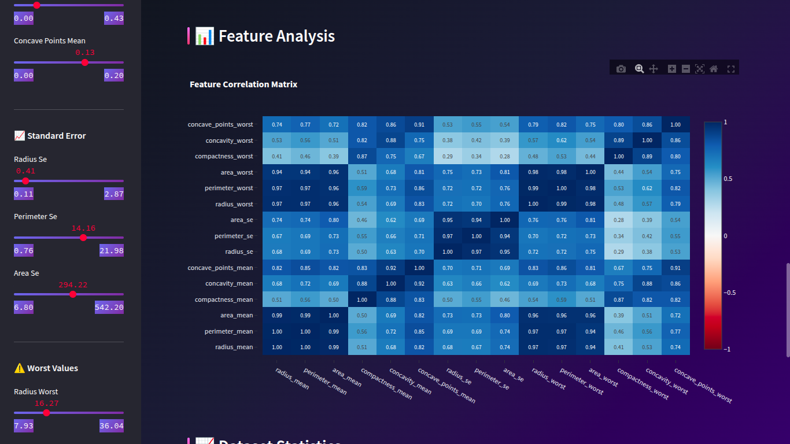
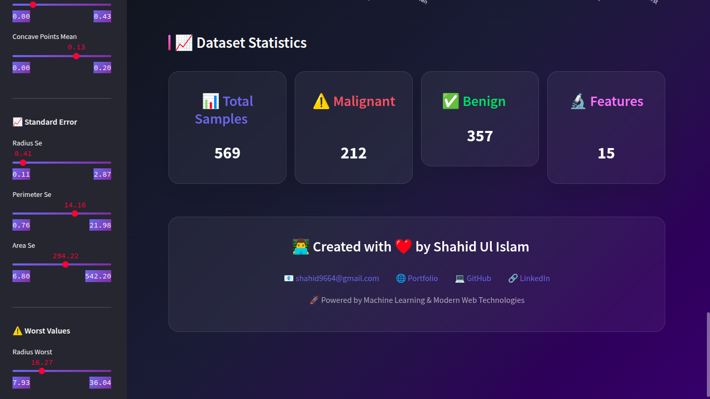

# Breast Cancer Prediction


A web application built with Streamlit to predict breast cancer based on tumor features. This project uses a Random Forest Classifier model trained on the Breast Cancer Wisconsin (Diagnostic) dataset.

---

## Features

-   **Interactive Prediction**: Users can input tumor features through sliders in the sidebar to get a real-time prediction of whether a tumor is malignant or benign. 
-   **Data Visualization**: The application displays a correlation heatmap and distribution plots of the dataset features. 
-   **User-Friendly Interface**: A simple and intuitive web interface powered by Streamlit. 

---

## Dataset

The model is trained on the **Breast Cancer Wisconsin (Diagnostic) Dataset**. This dataset contains features computed from a digitized image of a fine needle aspirate (FNA) of a breast mass. They describe characteristics of the cell nuclei present in the image. 

-   **Number of Instances**: 569 
-   **Number of Attributes**: 30 numeric, predictive attributes and the class 
-   **Class Distribution**: 212 Malignant, 357 Benign 

---

## Model

The prediction model is a **Random Forest Classifier** from the scikit-learn library. 

-   **Model Training**: The model is trained on a scaled version of the dataset, split into 80% for training and 20% for testing. 
-   **Model Evaluation**: The model's performance is evaluated using a classification report, confusion matrix, and ROC-AUC score. 
-   **Model Serialization**: The trained model is saved as `breast_cancer_model_v2.pkl` using `joblib` for use in the Streamlit application. 

---

## Technologies Used

-   **Python**: The core programming language for the project.
-   **Streamlit**: For creating and deploying the web application.
-   **Pandas**: For data manipulation and analysis. 
-   **Numpy**: For numerical operations.
-   **Scikit-learn**: For implementing the machine learning model and preprocessing. 
-   **Joblib**: For saving and loading the trained model. 
-   **Plotly and Seaborn**: For creating interactive and static visualizations. 
-   **Jupyter Notebook**: For model development and experimentation. 

---

## Installation and Setup

1.  **Clone the repository**:
    ```bash
    git clone [https://github.com/Khanz9664/Breast-Cancer-Prediction.git](https://github.com/Khanz9664/Breast-Cancer-Prediction.git)
    cd Breast-Cancer-Prediction
    ```

2.  **Create a virtual environment**:
    ```bash
    python -m venv venv
    source venv/bin/activate  # On Windows, use `venv\Scripts\activate`
    ```

3.  **Install the dependencies**:
    ```bash
    pip install -r requirements.txt
    ```

---

## Usage

To run the Streamlit application, execute the following command in your terminal:

```bash
streamlit run App.py
```
This will open the application in your default web browser. You can then use the sliders in the sidebar to input the tumor features and see the prediction.

-----

## Screenshots







-----

## License

This project is licensed under the MIT License. See the `LICENSE` file for more details.
